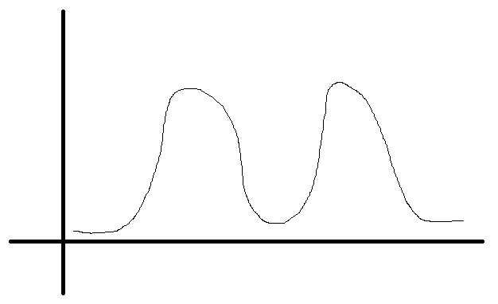
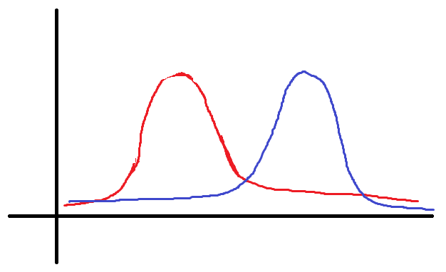

# Exercice 1 : Mélanges et algorithme EM

## Préambule

- Qu'est ce qu'un "mélange" de lois ?

On considère un échantillon $x= (x1,...,xn)$ composé de $n$ observations indépendantes $x_i∈X$. Chaque observation est issue d’un mélange à $K$ composantes déterminées par $p(x_i;\theta)=\sum_{k=1}^{K}\pi_kp_k(x_i;\alpha_k)$,avec $\theta \in \Theta$.

Idée : 
- chaque point a une probabilité $\pi_k$ d'appartenir à une des deux courbes (= proportion des points correspondant à chacune des 2 courbes, bien entendue inconnue), $\sum \pi_k =1$
- la loi de chaque courbe est $p_k(x_i;\alpha_k)$ avec $\alpha_k$ les paramètres de la loi $p_k$ (si $p_k$ est une loi normale $\alpha_k=(\mu_k,\sigma_k)$)
- Ce qui donne en additionnant chaque loi probable $p(x_i;\theta)=\sum_{k=1}^{K}\pi_kp_k(x_i;\alpha_k)$

a)
- log-vraisemblance $l(\theta;x)$

Vraissemblance : $L(\theta,x)=\prod_{i=1}^np(x_i;\theta)$

$l(\theta;x)$ = $\sum_{i=1}^{n}ln(p(x_i;\theta))$
         = $\sum_{i=1}^{n}ln(\sum_{k=1}^{K}\pi_kp_k(x_i;\alpha_k))$
         
On obtient une équation sous une forme difficilement estimable (même par optimisation par un logiciel)

- log-vraisemblance complétée $l(\theta;x,z)$

Idée : si on sait à quelle classe appartient chaque point, la loi est beaucoup plus simple

On introduit la variable catégorielle de l'appartenance à la classe : $Classe_i=k$
Pour rester numérique on choisit de la noter avec des variables booléenne $Z_k$, telle que $z_{i,k}=1$ si $Classe_i=k$, sinon $z_{i,k}=0$

Pour le point $i$, on ne retient plus que la composante auquel il appartient

La "contribution" à la log-vraissembalnce du point $i$ appartenant à la classe k_0 est donc :
$$
ln(\pi_{k_0}p_{k_0}(x_i;\alpha_{k_0}))=z_{i_{k_0}}ln(\pi_{k_0}p_{k_0}(x_i;\alpha_{k_0}))
$$
car $z_{i_{k_0}}=1$
$$
=\sum_{k=1}^{K}z_{i,k}ln(\pi_kp_k(x_i;\alpha_k))
$$
car $z_{i_{k}}=0, \forall k\neq k_0$

soit

$l(\theta;x,z)=\sum_{i=1}^{n}\sum_{k=1}^{K}z_{i,k}ln(\pi_kp_k(x_i;\alpha_k))$

le modèle reste complexe, mais peut être résolu par l'algorithme EM qui va avoir le bon gout de nous donner une estimation des $Z_k$ (et donc une classification)

b)

$t_{i,k}(\theta)$ probabilité *a posteriori* sous le paramètre $\theta$  que  l’observation $i$ soit  issue de la composante $k$.
:warning: les $\pi_k$ sont les probabilité *a priori* et **font partie** de $\theta$ !!!

Calcul de probabilité à posteriori (Bayes)
$$
t_{i,k}(\theta)=P_\theta(z_{i,k}=1|X_i=x_i)=\frac{P_\theta(z_{i,k}=1)P_\theta(X_i=x_i|z_{i,k}=1)}{P_\theta(X_i=x_i)}
=\frac{\pi_kp_k(x_i;\alpha_k)}{p(x_i;\theta)}
$$

=> $t_{i,k}$ est donc l'espérance conditionnelle de $z_{i,k}$ sachant $x_i$ (espérance d'un Bernoulli B = P(B=1))

=> pour un i donné, la meilleure espérance parmi les k nous donne la classe la plus probable. Donc non seulement on va obtenir une classification, mais en plus on sera capable de mesurer à quel point un point est vraiment sûr dans une classe ou en ballotage (cas avec des probas 0.9/0.1 VS probas 0.49/0.51)

c)

Soit $E(t(\theta),z)=-\sum_{i=1}^{n}\sum_{k=1}^Kz_{i,k}ln(t_{i,k}(\theta))$, 
avec $t(\theta) = (t_{i,k}(\theta);i= 1,...,n;k= 1,...,K)$ (vecteur des probabilités a posteriori)

Vérifier la formule d’Hathaway :
$l(\theta;x) =l(\theta;x,z) +E(t(\theta),z)$

À partir du calcul de $t_{i_k}$ précédent, que l'on passe au logarithme :
$ln(t_{i,k}(\theta))=ln(\pi_kp_k(x_i;\alpha_k))-ln(p(x_i;\theta))$

On écrit l'équation $K$ fois en multipliant par $z_{i,k}$ chaque ligne, et on somme les lignes

$$
\implies \sum_{k=1}^Kz_{ik}ln(t_{i,k}(\theta))
=\sum_{k=1}^Kz_{ik}ln(\pi_kp_k(x_i;\alpha_k))-ln(p(x_i;\theta))\sum_{k=1}^Kz_{i_k}
$$
($ln(p(x_i;\theta))$ ne dépend pas de $k$)

$\iff ln(p(x_i;\theta)) = \sum_{k=1}^Kz_{i,k}ln(\pi_kp_k(x_i;\alpha_k)) - \sum_{k=1}^Kz_{i,k}ln(t_{i,k}(\theta))$

Soit en sommant sur i :
$l(\theta;x) = l(\theta,x,z) + E(t(\theta),z)$

## L'algorithme EM

EM = espérance - maximisation

Paramétrage "fixe" : le nombre de classe K

Initialisation : choix d'un paramètre $\theta^{[0]}$ : $\theta$ est constitué des $\pi_k$ + des vecteurs $\alpha_k$ de chaque loi constituant le mélange
Exemple : mélange de 3 lois normales : 9 paramètres, les 3 proportions de classes + la moyenne et la variance de chaque classe (en réalité 8 paramètres car la dernière proportion est contrainte par 100-les deux premières)

Sur une itération $r$
- l'étape d'espérance : calcul de la logvraissamblance complété passant par le calcul des $t_{i_k}(\theta^{[r-1]})$
En effet la log vraissemblance complété vaut
$l(\theta;x,z)=\sum_{i=1}^{n}\sum_{k=1}^{K}z_{i,k}ln(\pi_kp_k(x_i;\alpha_k))$, comme on ne connait pas Z, on remplace par son espérance qui est donc $t_{i_k}$

- l'étape de maximisation : on maximise l'espérance de la vraissamblance complétée, c'est à dire recherche du nouveau $\theta^{[r]}$ qui maximise $\sum_i\sum_kt_{i,k}(\theta^{[r-1]})ln(\pi_kp_k(x_i;\alpha_k))$

On itère jusqu'à stabilisation de la vraissemblance

:warning: initialisation aléatoire => possibilité de tomber sur un maximum local => lancer l'algorithme pusieurs fois et conserver le meilleur résultat

## Convergence de l'algorithme

$\Theta$ est l'espace des paramètres possibles

Soit $\theta^{[r]} \in \Theta,\theta^{[r-1]} \in \Theta$, montrer que 
$$
l(\theta^{[r]};x)=Q(\theta^{[r]};\theta^{[r-1]}) - H( \theta^{[r]};\theta^{[r-1]})
$$
avec 
$$
Q(\theta^{[r]};\theta^{[r-1]}) =E_{\theta^{[r-1]}}[l(\theta^{[r]};x,z)|X_i=x_i]
$$
$$
H(\theta^{[r]};\theta^{[r-1]}) =\sum_{i=1}^n\sum_{k=1}^KE_{\theta^{[r-1]}}[z_{i,k}ln(t_{ik}(\theta^{[r]}))|X_i=x_i]
$$
et $E_{\theta^{[r-1]}}[.]$ l'espérance prise en considérant la distribution mélange avec le paramère $\theta^{[r-1]}$.

Rappel : à chaque étape on cherche à maximiser un paramètre $\theta^{[r]}$ en se servant de la valeur qu'il avait à l'itération prédédente pour calculer la vraissamblance complétée.
dans les écritures de $H$ et $Q$, $\theta^{[r-1]}$ est le paramètre de l'itération précédente, $\theta^{[r]}$ est le nouveau paramètre à rechercher pour maximiser la vraissemblance.

$$
l(\theta^{[r]};x)=\sum_{i=1}^n ln(p(xi;\theta^{[r]}))= \sum_{i=1}^n\sum_{k=1}^Kz_{i,k}ln(\pi_k^{[r]}p_k(x_i;\alpha_k^{[r]})) - \sum_{i=1}^n\sum_{k=1}^Kz_{i,k}ln(t_{i,k}(\theta^{[r]}))
$$
(Voir formule d'Hathaway plus haut)

On passe à l'espérance sous le paramètre $\theta^{[r-1]}$ conditionnellement à $X_i=x_i$
La seule chose aléatoire, ce sont les $z_{i,k}$, qui vont dont être estimés par leur espérance qui se calcule dans le cadre d'un paramétrage, ici celui de l'itération précédente $\theta^{[r-1]}$
$$
\sum_{i=1}^n E_{\theta^{[r-1]}}[ln(p(xi;\theta^{[r]}))|X_i=x_i]= \sum_{i=1}^n\sum_{k=1}^KE_{\theta^{[r-1]}}[z_{i,k}ln(\pi_k^{[r]}p_k(x_i;\alpha_k^{[r]}))|X_i=x_i] - \sum_{i=1}^n\sum_{k=1}^KE_{\theta^{[r-1]}}[z_{i,k}ln(t_{i,k}(\theta^{[r]}))|X_i=x_i]
$$
le premier terme est déterministe, il s'agit de l'espérance d'un scalaire
$$
\iff \sum_{i=1}^n ln(p(xi;\theta^{[r]})) = \sum_{i=1}^n\sum_{k=1}^KE_{\theta^{[r-1]}}[z_{i,k}ln(\pi_k^{[r]}p_k(x_i;\alpha_k^{[r]}))|X_i=x_i] - \sum_{i=1}^n\sum_{k=1}^KE_{\theta^{[r-1]}}[z_{i,k}ln(t_{i,k}(\theta^{[r]}))|X_i=x_i]
$$
on resimplifie ensuite les expressions de log vraissemblance et log vraissemblance complétée pour revenir à la formule
$$
\iff l(\theta^{[r]};x) = E_{\theta^{[r-1]}}[l(\theta^{[r]};x,z)|X_i=x_i] - \sum_{i=1}^n\sum_{k=1}^KE_{\theta^{[r-1]}}[z_{i,k}ln(t_{i,k}(\theta^{[r]}))|X_i=x_i]
$$
$$
\iff  l(\theta^{[r]};x) = Q(\theta^{[r]},\theta^{[r-1]}) - H(\theta^{[r]},\theta^{[r-1]})
$$

*Écrire la différence entre les log-vraisemblances obtenues aux itérations $r$ et $r-1$ à partir des fonctions Q et H*

$$
l(\theta^{[r]};x)-l(\theta^{[r-1]};x)=Q(\theta^{[r]},\theta^{[r-1]}) - Q(\theta^{[r-1]},\theta^{[r-1]}) - H(\theta^{[r]},\theta^{[r-1]}) + H(\theta^{[r-1]},\theta^{[r-1]})
$$

On s'intéresse donc à l'évolution de la vraissemblance entre l'ancienne valeur (itération précédente) $\theta^{[r-1]}$ et la nouvelle valeur $\theta^{[r]}$, pour cela on le décompose sous le paramétrage de l'itération précédente fixé $\theta^{[r-1]}$ 

*Montrer que :* $Q(\theta^{[r]};\theta^{[r-1]})- Q(\theta^{[r-1]};\theta^{[r-1]})\geq0$

$$
Q(\theta^{[r]};\theta^{[r-1]}) = \max_{\theta \in \Theta} Q(\theta;\theta^{[r-1]})
$$
en effet, par construction de l'algorithme EM
$$
\theta^{[r]} = \arg\max_{\theta \in \Theta} \sum_{i=1}^{n}\sum_{k=1}^{K}t_{i,k}(\theta^{[r-1]})ln(\pi_kp_k(x_i;\alpha_k)) = \arg\max_{\theta \in \Theta} E_{\theta^{[r-1]}}[l(\theta;x,z)|X_i=x_i]
$$
et $Q(\theta;\theta^{[r-1]}) =E_{\theta^{[r-1]}}[l(\theta;x,z)|X_i=x_i]$
La quantité $Q$ n'est rien d'autre que la vraissemblance complété calculée avec $\theta^{[r-1]}$
$$
\implies Q(\theta^{[r]};\theta^{[r-1]}) ≥ Q(\theta^{[r-1]};\theta^{[r-1]})
$$

*En utilisant l’[inégalité de Jensen](https://fr.wikipedia.org/wiki/In%C3%A9galit%C3%A9_de_Jensen), montrer que :* $H(\theta^{[r]};\theta^{[r-1]})-H(\theta^{[r-1]};\theta^{[r-1]})≤0$

$$
H(\theta^{[r]};\theta^{[r-1]})-H(\theta^{[r-1]};\theta^{[r-1]})
$$
$$
=\sum_{i=1}^n\sum_{k=1}^nE_{\theta^{[r-1]}}[z_{i,k}ln(t_{ik}(\theta^{[r]}))|X_i=x_i] - \sum_{i=1}^n\sum_{k=1}^nE_{\theta^{[r-1]}}[z_{i,k}ln(t_{ik}(\theta^{[r-1]}))|X_i=x_i]
$$

Attention : $ln(t_{ik}(\theta^{quelconque}))$ est déterministe ! La seule chose aléatoire dans les espérance ce sont les $z_{i,k}$

$$
=\sum_{i=1}^n\sum_{k=1}^n ln(t_{ik}(\theta^{[r]})) E_{\theta^{[r-1]}}[z_{i,k}|X_i=x_i] - \sum_{i=1}^n\sum_{k=1}^n ln(t_{ik}(\theta^{[r-1]})) E_{\theta^{[r-1]}}[z_{i,k}|X_i=x_i]
$$
et $E_{\theta^{[r-1]}}[z_{i,k}|X_i=x_i]$ est la définition de $t_{i,k}(\theta^{[r-1]})$
$$
=\sum_{i=1}^n\sum_{k=1}^n t_{ik}(\theta^{[r-1]})[ln(t_{ik}(\theta^{[r]})) - ln(t_{ik}(\theta^{[r-1]}))]
$$
$$
=\sum_{i=1}^n\sum_{k=1}^n t_{ik}(\theta^{[r-1]})ln(\frac{t_{ik}(\theta^{[r]})}{t_{ik}(\theta^{[r-1]})})
$$

On utilise Jensen et la concavité du logarithme ainsi :
$$
\sum_{k=1}^Ku_kln(v_k) \leq ln(\sum_{k=1}^Ku_kv_k)
$$
si les $u_k$ positifs et $\sum u_k=1$

$t_{ik}(\theta^{[r-1]}) \geq 0$ et $\sum_k t_{ik}(\theta^{[r-1]})=1$ car i appartient forcément à une des classes, donc la somme des probabilités d'appartenance à chacune des classes vaut 1

On remplace donc $u_k$ par $t_{ik}(\theta^{[r-1]})$ et $v_k$ par $\frac{t_{ik}(\theta^{[r]})}{t_{ik}(\theta^{[r-1]})}$ et on conclue

$$
H(\theta^{[r]};\theta^{[r-1]})-H(\theta^{[r-1]};\theta^{[r-1]})≤\sum_{i=1}^nln(\sum_{k=1}^Kt_{ik}(\theta^{[r]}))=0
$$

En cumulant les deux résultats précédents, on aboutit à 
$$
l(\theta^{[r]};x)-l(\theta^{[r-1]};x)\geq 0 \iff l(\theta^{[r]};x) \geq l(\theta^{[r-1]};x)
$$

On obtient qu'à chaque itération la vraissemblance augmente forcément, ce qui assure que l'algorithme va forcément converger vers un maximum local. (Au pire on stagne, ce qui sgnifie qu'on a atteint ce maximum)

# Exercice 2 : Mélanges de distribution de Poisson

La [loi de Poisson](https://fr.wikipedia.org/wiki/Loi_de_Poisson) est une loi discrète définie par $p(X=x)=\frac{\lambda^x}{x!}e^{-\lambda}$
Elle posède donc un paramètre : $\lambda$

On considère un échantillon $x= (x_1,...,x_n)$ composé de $n$ observations indépendantes $x_i∈\mathbb{N}$.  Pour effectuer le clustering, on suppose que les données sont issues d’un mélange de distributions de Poisson à $K$ composantes.

Si on mélange $K$ lois de poisson, on a donc $2K$ paramètres à estimer, $K$ $\lambda_k$ et $K$ $\pi_k$ (donc un forcé par contrainte $\sum \pi_k =1$)
$\theta = (\lambda_1,...,\lambda_K,\pi_1,...,\pi_K)$

Écriture générale
$$
p(x_i;\theta) = \sum_{k=1}^K \pi_k p_k(x_i;\lambda_k)
$$
ici :
$$
p(x_i;\theta) = \sum_{k=1}^K \pi_k \frac{{\lambda_k}^{x_i}}{x_i!}e^{-\lambda_k}
$$
Les $\lambda_k$ sont positifs, et différents 2 à 2 (si 2 sont identiques, c'est la même composante)

Dans ces conditions, le modèle est-il identifiable ?
C'est à dire :
si $\forall x \in \mathbb{N}, p(x,\theta)=p(x,\tilde \theta) \implies \theta = \tilde \theta$
Dans le cas d'un mélange l'unicité se définit "à permutation des composantes près"
Pour cela on choisit par exemple de trier les $\lambda_k$ du plus grand au plus petit : contrainte sur "l'ordre" des composantes

Supposons $\forall x \in \mathbb{N}, p(x,\theta)=p(x,\tilde \theta)$
On choisit que si $\lambda_1 \neq \tilde \lambda_1$ alors on "classe" $\theta$ et $\tilde \theta$ tel que $\lambda_1 > \tilde \lambda_1$, c'est à dire qu'on suppose $\lambda_1 \geq \tilde \lambda_1$

$$
p(x,\theta)=p(x,\tilde \theta)
$$
$$
\iff \sum_{k=1}^K \pi_k \frac{{\lambda_k}^{x_i}}{x_i!}e^{-\lambda_k}=\sum_{k=1}^K \tilde \pi_k \frac{{\tilde \lambda_k}^{x_i}}{x_i!}e^{-\tilde \lambda_k}
$$
$$
\iff \pi_1 \frac{{\lambda_1}^{x_i}}{x_i!}e^{-\lambda_1} + \sum_{k=2}^K \pi_k \frac{{\lambda_k}^{x_i}}{x_i!}e^{-\lambda_k}=\tilde \pi_1 \frac{{\tilde \lambda_1}^{x_i}} {x_i!}e^{-\tilde \lambda_1} + \sum_{k=2}^K \tilde \pi_k \frac{{\tilde \lambda_k}^{x_i}}{x_i!}e^{-\tilde \lambda_k}
$$
$$
\iff 1 + \sum_{k=2}^K \frac{\pi_k}{\pi_1} \frac{{\lambda_k}^{x_i}}{{\lambda_1}^{x_i}}e^{\lambda_1-\lambda_k}=\frac{\tilde \pi_1}{\pi_1} \frac{{\tilde \lambda_1}^{x_i}}{{\lambda_1}^{x_i}}e^{\lambda_1 - \tilde \lambda_1} + \sum_{k=2}^K \frac{\tilde \pi_k}{\pi_1} \frac{{\tilde \lambda_k}^{x_i}}{{\lambda_1}^{x_i}}e^{\lambda_1-\tilde \lambda_k}
$$
Par hypothèse, on a $\lambda_1>\lambda_k$ et $\lambda_1 \geq \tilde \lambda_1 > \tilde \lambda_k$
Donc :
$\forall k>1,\frac{\lambda_k}{\lambda_1}<1$
$\forall k>1,\frac{\tilde \lambda_k}{\lambda_1}<1$
Donc :
$\forall k>1,\lim_{x\to\infty}\frac{\pi_k}{\pi_1}(\frac{\lambda_k}{\lambda_1})^{x_i}e^{(\lambda_1-\lambda_k)}=0$
$\forall k>1,\lim_{x\to\infty}\frac{\pi_k}{\pi_1}(\frac{\tilde \lambda_k}{\lambda_1})^{x_i}e^{(\lambda_1-\tilde \lambda_k)}=0$

Soit en revenant à l'égalité précédente
$$
\iff 1 = \lim_{x\to\infty}\frac{\tilde \pi_1}{\pi_1} \frac{{\tilde \lambda_1}^{x_i}}{{\lambda_1}^{x_i}}e^{\lambda_1 - \tilde \lambda_1} 
$$
et
$$
\lim_{x\to\infty} \frac{\tilde \pi_1}{\pi_1} \frac{{\tilde \lambda_1}^{x_i}}{{\lambda_1}^{x_i}}e^{\lambda_1 - \tilde \lambda_1} = \frac{\tilde \pi_1}{\pi_1} \text{ si } \lambda_1 = \tilde \lambda_1
$$
$$
\lim_{x\to\infty} \frac{\tilde \pi_1}{\pi_1} \frac{{\tilde \lambda_1}^{x_i}}{{\lambda_1}^{x_i}}e^{\lambda_1 - \tilde \lambda_1} = 0\text{ si } \lambda_1 > \tilde \lambda_1
$$

Donc (par l'absurde) $\lambda_1 = \tilde \lambda_1$ et de fait $\pi_1 = \tilde \pi_1$

Une fois qu'on a montré le résultat pour ce premier paramètre on effectue le même raisonnement pour les paramètres suivant

## Estimation par maximum de vraissemblance

$$
l(\theta;x)=\sum_{i=1}^nln(\sum_{k=1}^n \pi_k \frac{\lambda_k^{x_i}}{x_i!}e^{-\lambda_k})
$$
$$
l(\theta;x,z)=\sum_{i=1}^n\sum_{k=1}^nz_{i,k}ln( \pi_k \frac{\lambda_k^{x_i}}{x_i!}e^{-\lambda_k})
$$
$$
=\sum_{i=1}^n\sum_{k=1}^nz_{i,k}(ln( \pi_k ) + x_iln(\lambda_k) - ln(x_i!) -\lambda_k)
$$

**Algorithme EM**

On choisit au hasard les $\pi_k^{[0]}$, tels que $0<\pi_k^{[0]}<1$ et $\sum \pi_k^{[0]} =1$
ainsi que les $\lambda_k^{[0]}$ positifs

On choisit un $\epsilon$ petit qui sera le seuil à partir du quel on cosidèrera que l'évolution est minime, et que l'on arrive ainsi au maximum

Soit un critère d'arrêt de l'algorithme
$l(\theta^{[r]};x) - l(\theta^{[r-1]};x)\leq\epsilon$

A chaque étape

- On détermine une estimation des $z_{ik}$, les $t_{ik}$ calculés à l'aide des apriori, cad les paramètres de l'itération précédente :
$$
t_{ik}(\theta^{[r-1]})=\frac{\pi_k^{[r-1]}p_k(x_i;\lambda_k^{[r-1]})}{\sum_l \pi_l^{[r-1]}p_l(x_i;\lambda_l^{[r-1]})}
$$

- On maximise la vraissemblance complétée que l'on sait désormais calculer
$l(\theta;x,z)$ non calculable car dépendant des $z_{ik}$ inconnus devient $l(\theta;x,t(\theta^{[r-1]}))$ 
avec $t(\theta^{[r-1]})$ l'ensemble des $t_{ik}(\theta^{[r-1]})$
Soit la recheche de 
$$
\theta^{[r]}=\arg\max_{\theta}l(\theta;x,t(\theta^{[r-1]}))=\arg\max_{\theta}\sum_{i=1}^n\sum_{k=1}^nt_{ik}(\theta^{[r-1]})ln( \pi_k \frac{\lambda_k^{x_i}}{x_i!}e^{-\lambda_k})
$$

*Calcul des $\lambda_k$*

$$
\frac{\partial}{\partial \lambda_k}l(\theta;x,t(\theta^{[r-1]}))= \sum_i t_{ik}(\theta^{[r-1]})\frac{\partial}{\partial \lambda_k}(ln(\pi_k) -ln(x_i!)+x_iln(\lambda_k)-\lambda_k)
$$
$$
= \sum_i t_{ik}(\theta^{[r-1]})(\frac{x_i}{\lambda_k}-1)
$$
:warning: les $t_{ik}(\theta^{[r-1]})$ ne dépendent pas de $\lambda_k$ (mais de $\lambda_k^{[r-1]})$ !
$$
\frac{\partial}{\partial \lambda_k}l(\theta;x,t(\theta^{[r-1]}))= 0 \iff \frac{1}{\lambda_k^{[r]}}\sum_i t_{ik}(\theta^{[r-1]})x_i = \sum_i t_{ik}(\theta^{[r-1]})
$$
$$
\iff \lambda_k^{[r]} = \frac{\sum_i t_{ik}(\theta^{[r-1]})x_i}{\sum_i t_{ik}(\theta^{[r-1]})} 
$$

*Calcul des $\pi_k$*

Il s'agit d'une estimation sous contrainte ($\sum_k \pi_k =1$), on utilise donc un lagrangien

$L(\theta,\mu)=l(\theta;x, t_{ik}(\theta^{[r-1]})) - \mu (\sum_k \pi_k - 1)$
$$
\frac{\partial}{\partial \pi_k} L(\theta) = \sum_i t_{ik}(\theta^{[r-1]}) \frac{\partial}{\partial \pi_k}(ln(\pi_k) -ln(x_i!)+x_iln(\lambda_k)-\lambda_k)  - \mu
$$
$$
= \sum_i \frac{t_{ik}(\theta^{[r-1]}) }{\pi_k} - \mu
$$
(dériver selon $\mu$ fait simplement retrouver la contrainte $\sum_k\pi_k=1$)
$$
\frac{\partial}{\partial \pi_k} L(\theta) = 0 \iff \pi_k^{[r]}=\frac{1}{\mu}\sum_i t_{ik}(\theta^{[r-1]})
$$
puis on a par contrainte
$$
\sum_k \pi_k^{[r]}=1=\frac{1}{\mu}\sum_k\sum_i t_{ik}(\theta^{[r-1]})
$$
par construction 
$$
\sum_k t_{ik}(\theta^{[r-1]}) = 1
$$
donc 
$$
\sum_k\sum_i t_{ik}(\theta^{[r-1]}) =n
$$
soit $\mu=n$ et
$$
\pi_k^{[r]}=\frac{1}{n}\sum_i t_{ik}(\theta^{[r-1]})
$$
Au final étant donné que les $t_{ik}$ sont les espérances d'appartenance à chacune des classes, la somme est donc l'espérance de l'effectif de chacune des classes et on ne fait donc que calculer une fréquence (espérance du nombre d'individu dans la classe divisé par n) !

*Itération suivante*

Connaissant les nouveaux paramètres de $\theta$ on peut calculer la nouvelle valeur de la vraissemblance $l(\theta^{[r]};x)$ que l'on compare à celle de l'itération précédente

### Remarque : algorithme CEM

C'est l'algorithme EM plus réaliste du point de vue de la classification.
Au lieu de remplacer les $z_{ik}$ par leur espérance $t_{ik}$, on effectue la classification, c'est à dire que l'on affecte chaque $i$ dans la classe où il est le plus probable, cad vérifiant $\max_kt_{ik}$
On remplace donc les $z_{ik}$ par des valeurs plus réelles, 1 si $i$ a été affecté à $k$ lors de l'itération $[r-1]$, 0 sinon.
Dans l'algorithme CEM, les $\pi_k^{[r]}$ sont les vrais proportions des classes formées à l'itération $[r-1]$

### Remarque : méthode aléatoire

Comme pour les k-means, la méthode peut aboutir à un maximum local. Il faut donc relancer plusieurs fois l'algorithme, et conserver le cas qui a donné le plus haut résultat de vraissemblance (le maximum des maximum locaux a des chances d'être le maximum global)

### Remarque : choisir le nombre de classes

On pourrait se dire que l'on choisit $K$ tel que le maximum de vraissemblance obtenu soit le meilleur possible.
Mais comme avec l'inertie intra des méthodes géométriques, mécaniquement en augmentant K, le maximum de vraissemblance sera toujours plus élevé.
En effet $K$ plus élevé signifie un plus grand nombre de paramètres, ce qui améliore forcément le modèle.
On utilise au final des critères qui pénalisent le nombre de paramètre, AIC et BIC. C'est le même raisonnement que lorsqu'on observe un coude dans les gains d'inertie intra, on se demande si l'ajout de paramètre est "rentable".

# Exercice 3 : Lien entre clustering géométrique et probabiliste

On considère un échantillon $x=(x1,...,xn)$ composé de $n$ observations  indépendantes. Chaque observation $x_i∈\mathbb{R}^d$ est décrite par $d$ variables continues.
Montrer que le clustering de ces données en $K$ classes effectué par un algorithme des Kmeans avec la métrique diagonale $M=diag(\frac{1}{s^2_1},...,\frac{1}{s^2_d})$ (**métrique inverse des variances**) est équivalent à un clustering effectué par un algorithme CEM considérant le modèle défini par la densité suivante :

$$
p(x_i;\theta) =\sum_{k=1}^{K}\frac{1}{K}\prod_{j=1}^{d}\phi(x_{ij};\mu_{kj},s^2_j)
$$
avec 
$$
\phi(x_{ij};\mu_{kj},s^2_j)=\frac{1}{s_j\sqrt{2\pi}}e^{-\frac{1}{2}(\frac{x_{ij}-\mu_{kj}}{s_j})^2}
$$
la densité d'une loi normale d'espérance $\mu_{kj}$ et de variance $s^2_j$

- Vision géométrique : voir le premier exercice du TP ou l'on a créé 4 groupes de points avec des moyennes différentes
- Vision probabiliste : on observe une ditribution avec $K$ "cloches" superposées

**Clustering Kmeans**
Détermination de l'estimateur $(\tilde z,\tilde \mu)$, où les $\mu_k$ sont les centres obtenus et les $z_{ik}$ calculé selon les points dont $\mu_k$ est le plus proche
$$
(\tilde z,\tilde \mu) = \arg\min_{z,\mu} \sum_i\sum_k z_{ik} d^2_M(x_i,\mu_k)
$$
En effet on recherche la configuration selon laquelle l'inertie intra est la plus faible, càd telles que la somme de la somme des distances des points à leur baycentre est la plus faible
$$
 = \arg\min_{z,\mu} \sum_i\sum_k z_{ik} \sum_{j=1}^d\frac{(x_{ij} -\mu_{kj})^2}{s^2_j}
$$
le barycentre de classe k étant le point de coordonnées $\mu_k=(\mu_{k,1},...,\mu_{k,d})$

**Clustering CEM**
Détermination de l'estimateur $(\hat z,\hat \mu)$ obtenu par maximum de vraissemblance
$$
(\hat z,\hat \mu)=\arg\max_{z,\mu} \sum_i\sum_k z_{i_k}ln(\frac{1}{K}\prod_{j=1}^d\phi(x_{ij};\mu_{kj},s^2_j))
$$
$$
=\arg\max_{z,\mu} \sum_i\sum_k z_{i_k}ln(\frac{1}{K}) +z_{i_k} \sum_{j=1}^dln(\phi(x_{ij};\mu_{kj},s^2_j))
$$
$$
=\arg\max_{z,\mu} \sum_i\sum_k [ z_{i_k}ln(\frac{1}{K}) - z_{i_k} \frac{1}{2}\sum_{j=1}^dln(2\pi s_j^2) -z_{i_k} \frac{1}{2} \sum_{j=1}^d\frac{(x_{ij}-\mu_{kj})^2}{s^2_j} ]
$$
$$
=\arg\max_{z,\mu}   nln(\frac{1}{K}) - n\frac{1}{2}\sum_{j=1}^dln(2\pi s_j^2) - \sum_i\sum_kz_{i_k} \frac{1}{2} \sum_{j=1}^d\frac{(x_{ij}-\mu_{kj})^2}{s^2_j} 
$$
$$
=\arg\max_{z,\mu} - \sum_i\sum_kz_{i_k} \sum_{j=1}^d\frac{(x_{ij}-\mu_{kj})^2}{s^2_j} 
$$
$$
=\arg\min_{z,\mu} \sum_i\sum_kz_{i_k} \sum_{j=1}^d\frac{(x_{ij}-\mu_{kj})^2}{s^2_j} 
$$

